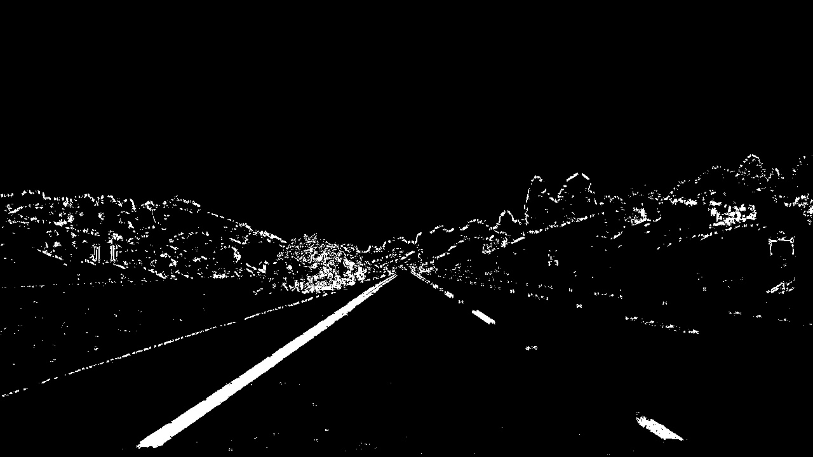
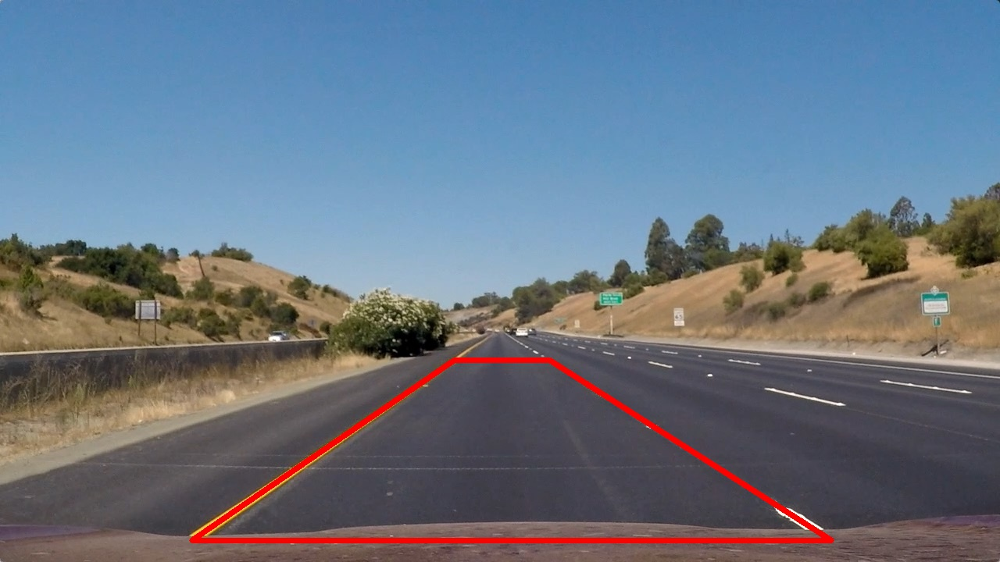
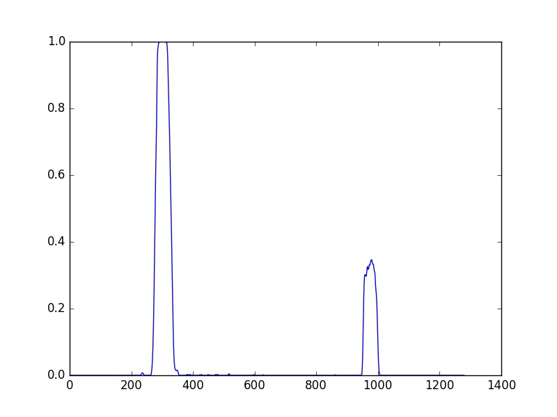
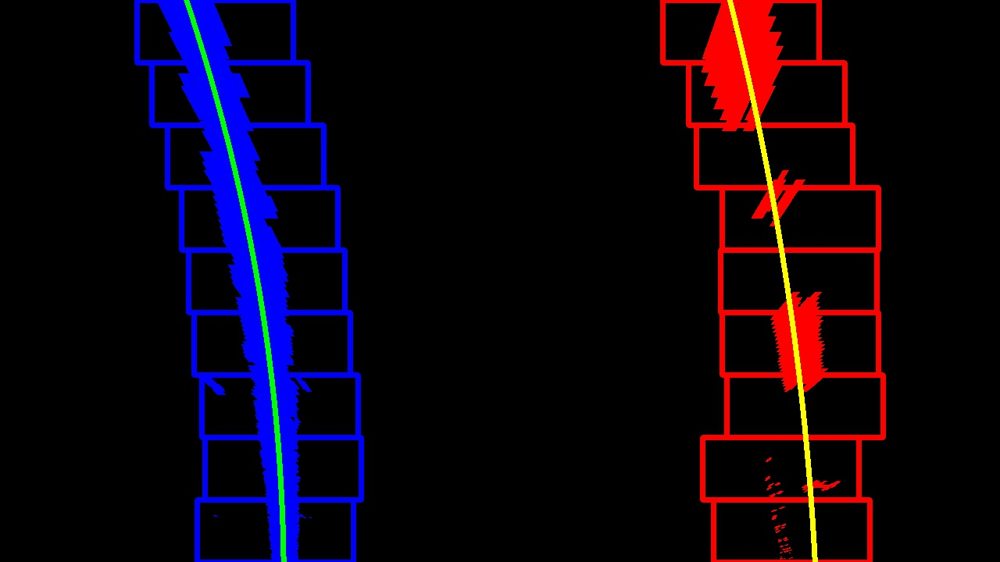
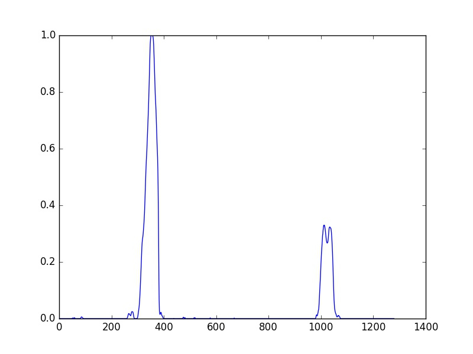
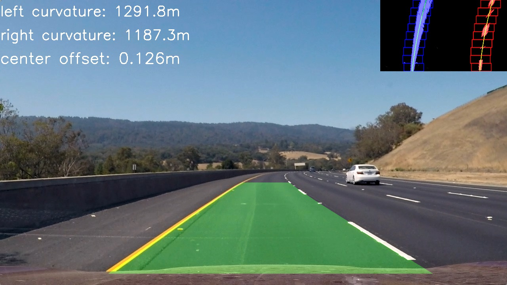
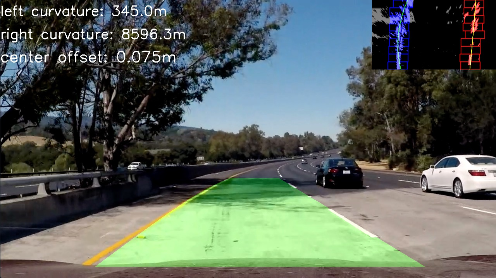

## Advanced Lane Finding Project
[](http://www.udacity.com/drive)

The goals / steps of this project are the following:

* Compute the camera calibration matrix and distortion coefficients given a set of chessboard images.
* Apply a distortion correction to raw images.
* Use color transforms, gradients, etc., to create a thresholded binary image.
* Apply a perspective transform to rectify binary image ("birds-eye view").
* Detect lane pixels and fit to find the lane boundary.
* Determine the curvature of the lane and vehicle position with respect to center.
* Warp the detected lane boundaries back onto the original image.
* Output visual display of the lane boundaries and numerical estimation of lane curvature and vehicle position.

###Project Organization
All source files below have been placed in `lanelines` folder:

- [`camera.py`](lanelines/camera.py): Define Camera class to detect and apply distortion correction and perspective transformation.
- [`binarizer.py`](lanelines/binarizer.py): Define Binarizer class to binarize an image using a combination of strategies. 
- [`detector.py`](lanelines/detector.py): Define Detector class responsible to detect lane lines in an input image. 
- [`line.py`](lanelines/line.py): Class to represent one line (right or left) detected in image frames.
- [`pipeline.py`](lanelines/pipeline.py): Class that define an execution pipeline for lane lines detection.
- [`process.py`](lanelines/process.py): Execute pipeline steps on sample images.
- [`process_video.py`](lanelines/process_video.py): Process video frames using the lane finding pipeline.

###Camera Calibration

The code for this step is contained in the *Camera* class from [camera.py](lanelines/camera.py).
The method [`calibrate`](lanelines/camera.py#L24) uses chessboard images from `camera_cal` folder to detect corners and calculate the distortion attributes using `cv2.calibrateCamera`.

These images have 9 by 6 corners but in some images not all are visible.
So the [`detect_image_points`](lanelines/camera.py#L111) was used to generate pairs of possible corners visible in chessboard image, e.g.: (9, 6), (9, 5), (9, 4), (8, 6), (7, 6).
The first detected pair of corners was stored in `imgpoints` and the real object points stored in `objpoints`, both used in camera calibration. 

Corner detection examples:


The parameters obtained in calibration was used in [`undistort`](lanelines/camera.py#L33) method.
This method calls `cv2.undistort()` function to get an undistorted image.

Distortion correction examples:


###Pipeline (single images)

####1. Distortion Correction
The same [`undistort`](lanelines/camera.py#L33) method described above was applied to images as a previous step in the lane detection pipeline.
See below three examples of lane images and its respective undistorted images.

Distorted images:


Distortion correction examples:


####2. Image Binarization 
The `Binarizer` class is responsible for this step.
The main method for image binarization is [`binarize`](lanelines/binarizer.py#L8).
This method uses a combination of strategies to get a binarized image.
 
First, the image was converted to grayscale and HLS color spaces.
On the HLS, the most significant results was obtained with the saturation channel, so it was used in the next step.
For both grayscale and saturation channel, three edge detection strategies were used:
- Sobel Operator: ([binarizer.py#L34](lanelines/binarizer.py#L34))
- Magnitude of the Gradient: ([binarizer.py#L41](lanelines/binarizer.py#L41))
- Direction of the Gradient: ([binarizer.py#L49](lanelines/binarizer.py#L49))

Those strategies were combined with the following code ([binarizer.py#L21](lanelines/binarizer.py#L21)):
```
combined[(gradx == 1) | ((mag_binary == 1) & (dir_binary == 1))] = 1
```

The binarization step was complemented with a color threshold strategy, using the saturation channel from HLS.

An equalized version of the grayscale channel was tried but it introduces too much noise to the binarized image and was discarded. 

See below examples of color images and its respective images binarized.

Color images examples:


Binarized examples:




####3. Perspective Transformation
The same `Camera` class used in distortion correction was used to perform perspective transformation.

A detection step has to be performed before apply perspective transformation on images.
For that, an input image and four points has to be provided to the [`detect_perspective`](lanelines/camera.py#L37) method.
This method automatically calculates the destination points, with the assumption that source points represent a quadrangle (required by the opencv `cv2.getPerspectiveTransform` method). 

This method was called in [process.py#L27](lanelines/process.py#L27) when processing the sample images.

See below the image and the points used to get the perspective transformation matrix:



All parameters needed to apply perspective transformation in the future is saved when the [`save`](lanelines/camera.py#L59) method from `Camera` is called.
So a call to `load` will reconstruct a `Camera` object restoring the values obtained in perspective detection (and also in the calibration step). 

The [`to_top_down`](lanelines/camera.py#L48) method apply a warp transformation to an input image using the matrix obtained in the process described above.
As a result, a top down representation of the image is generated.

This is the same image used in perspective detection transformed to top down (birds-eye) view:


See below another example of perspective transformation:


####4. Lane Lines Detection
The lane lines detection was implemented in the `Detection` class.
The main method for this class is [`detect`](lanelines/detect.py#L21).
This method expects a top down image and decide between two procedures to detect indexes for lane lines.

The first procedure is used when no previous line was detected and is defined by the [`sliding_window`](lanelines/detect.py#L69) method.
It uses a sliding window algorithm to find pixels that may belong to a single lane line.

This method has to be called twice, one for the right and another for the left line.
It expects a start position for `x` to bootstrap the sliding window algorithm.
This position is obtained using the [`histogram`](lanelines/detect.py#L90).
The max of the first half of the histogram is used for left line and the max for the other line is used for right line. 

The second procedure, defined by [`search_previous_line`](lanelines/detect.py#L56) method, uses previous line information to look for lane lines in the current image.

See below an example of a top down image (with the lane lines and windows used in detection drown) and its respective histogram.




Another example:




An example using previous line:


The lane line indexes is provided to the `Line` class.
This class represent a single lane line and stores properties from it.
The method [`fit`](lanelines/line.py#L24) uses these properties to fit a polynomial and stores it to be used in other steps.

The `Line` class keep an array of the last 20 fitted polynomial and return an average between them, so the calculated polynomial for an image is smoothed between frames in a video.

A polynomial is only taken in consideration when the line, given its pair (a left or right line), has similar curvature, slope and distance ([line.py#L62](lanelines/line.py#L62)).

####5. Radius of Curvature and Position of the Vehicle
The `Line` class was also used to calculate radius of curvature and the position of the vehicle with respect to center.

The method [`calculate_curvature`](lanelines/line.py#L37) uses the average polynomial to calculate the radius of curvature for the current line.

The method [`center_offset`](lanelines/line.py#L68) calculates the offset of the vehicle with respect to center using the average polynomial of the current line.

Both methods use an array `meters_per_pixels` that defines a conversion from pixels to real world meters in `x` and `y`. 

####6. Final Result

The `Pipeline` class is responsible of tie together all steps above and execute the full lane line detection procedure through the method [`process_image`](lanelines/pipeline.py#L60).
The [`draw_lane`](lanelines/pipeline.py#L24) is used to draw the lane in the top of the image.
It uses the inverse perspective matrix from camera to draw lane detected in the top down image back to the original image. 

Detected lines examples:






---

###Pipeline (video)

####1. Final Video Output.

Here's a [link to my video result](./project_video_processed.mp4?raw=true)

---

###Discussion

A fixed approach was used for the binarization step, so the threshold and algorithms used is invariable.
So, a more robust approach is to use an adaptive strategy.
For example, a histogram equalization or a more aggressive threshold may be applied when no lines was detected with a conservative method.
These strategies may be used against the decrease of performance with the variation of the road color.

The sliding window and the histogram method (to get the start point to search for lines) could also be improved.
Those methods do not work well in very sharp curves, as we see in the harder challenge video.
The histogram method may be improved to use a small horizontal slice of the image, and increasing this slice until a reliable position for a lane line is found. 

Also, a better use of previous frame information may be used to improve the tolerance to noise or other objects (like cars) that may be obstructing the line view.
A recurrent neural network like long short-term memory (LSTM) may be used to address this issue.

Finally, another approach for this problem is using a deep learning algorithm.
In this case the full image should be provided as input to a network which will learn by itself how to detect lane lines.
